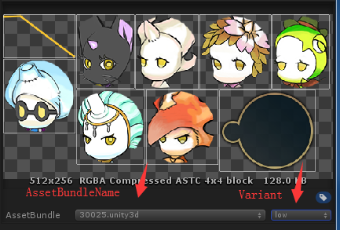
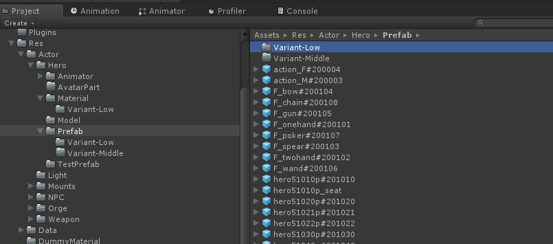

#AssetBundle 变体使用规范
##

* [前言](#1)
 * [AssetBundle Variant](#1.1)

* [使用规范](#2)
 * [变体定义](#2.1)
 * [项目中的使用规则](#2.2)
 * [资源打包](#2.3)
 * [资源加载](#2.4)
* [注意事项](#3)
* [参考文献](#4) 

##前言

###AssetBundle Variant

- Unity中可以通过设置AssetBundleName和Variant来生成AssetBundle Variant，生成的AssetBundle文件名为“AssetBundleName.Variant”，相同AssetBundleName不同Variant的资源视为一个资源的不同版本，使用相同的internal ID，拥有相同的依赖关系，所以切换加载不同变体不需要重新绑定资源，同时由于internal ID相同，所以同一资源的多个变体同一时刻只能加载其中一个。

- AssetBundle Variant主要用于解决按美术效果分级、多语言、多渠道等维度制作多个版本的资源，打包生成多个变体AssetBundle，加载资源时根据相应配置加载对应的变体资源，游戏逻辑不需要处理资源绑定切换的相关事宜。

##使用规范

###变体定义

- 项目中的所有美术资源类型都可制作变体，包括prefab、mesh、material、texture、sprite等等（shader暂不支持）。
- 规定按美术效果分为**High**、**Middle**、**Low**三个变体等级。
- 默认资源等级为**High**，即找不到目标等级的变体资源时则加载**High**变体。

###项目中的使用规则

1. 在需要制作变体的资源所在目录，建立一个子目录，目录名为“Variant-”+变体名，如“Variant-Low”。
2. 在变体文件夹中放入变体资源，文件名保持与原文件相同。
3. 同一层级的资源的同种变体资源都集中在同一个文件夹中，不同变体等级需要建立不同文件夹。

备注：使用目录名区分变体而不是文件名主要有以下几点考虑。

- 文件夹可以集中处理同一种变体的资源，移动删除改名都非常方便。
- 文件名不变，从AssetBundle加载资源时不需要根据变体变换assetName，游戏上层使用到的资源名也不会发生变化。 

###资源打包
这部分由资源管理器的打包工具自动处理，不需要人为干涉。

1. 搜索项目中所有“Variant-*”文件夹，解析出变体名，遍历变体文件夹内的文件，如果上层目录存在同名文件，则认为是目标文件的变体，记录匹配变体的文件列表。
2. 在为每一个资源设置AssetBundleName时，如果存在于变体文件列表中，为变体资源设置与原资源相同的AssetBundleName，设置变体名。注意，原资源需要设置为默认变体名，因为相同AssetBundleName的资源，只要其中一个启用了Variant，就要全部启用。
3. 如果正在处理的原资源没有AssetBundleName，则代表该资源在原本的打包策略中属于被依赖收集的资源，这时需要改变策略，给这个资源生成一个AssetBundleName，让其可以独立打包，使用上面相同的流程处理。
4. 打包AssetBundle，生成包括变体的所有AssetBundle。

###资源加载

- 资源管理器初始化时，从AssetBundleManifest中获取所有已打包的变体信息。
- 需要调用资源管理器接口AssetManager.Instance.ActivedVariants(string[] variants)，设置要激活的变体列表。
- 加载资源时，先检查该AssetBundle是否存在于变体列表中，如果不存在，则直接返回原始bundleName。
- 如果资源存在变体，则会按激活列表的顺序尝试匹配已打包的变体。用于质量控制时，建议激活两个变体：【目标变体，默认变体】。
- 处于容错性考虑，如果加载AssetBundle时，若激活的变体列表无法成功匹配到已打包的变体，则进入模糊匹配环节。
- 模糊匹配时，尝试在该AssetBundle已打包的所有变体中获取其中一个变体返回，匹配顺序无法保证, 此时如果匹配成功，会抛出警告，提示应该正确设置激活列表，避免发生模糊匹配。

##注意事项

- 同一时间，全局资源都只能加载同一变体版本，即不支持A资源加载High变体，B资源加载Low变体。
- 切换变体版本需要卸载所有资源和AssetBundle，全部重新加载，否则会报错，或造成内存泄漏。
- 变体资源名要求与原资源完全一致，否则不能自动匹配。

##参考文献

[https://blog.csdn.net/fansongy/article/details/50505181](https://blog.csdn.net/fansongy/article/details/50505181)