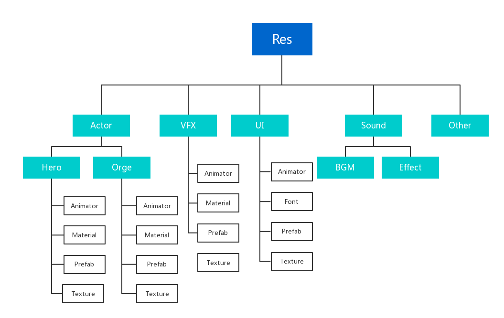
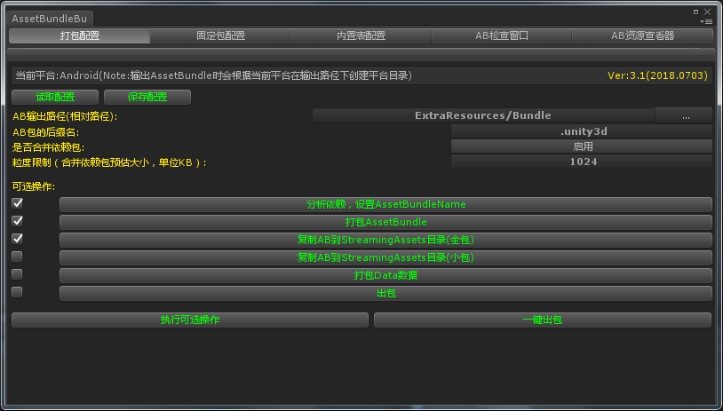
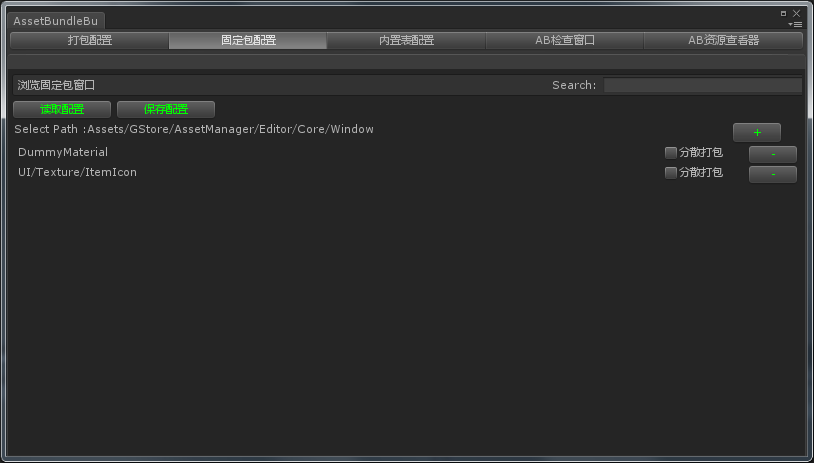
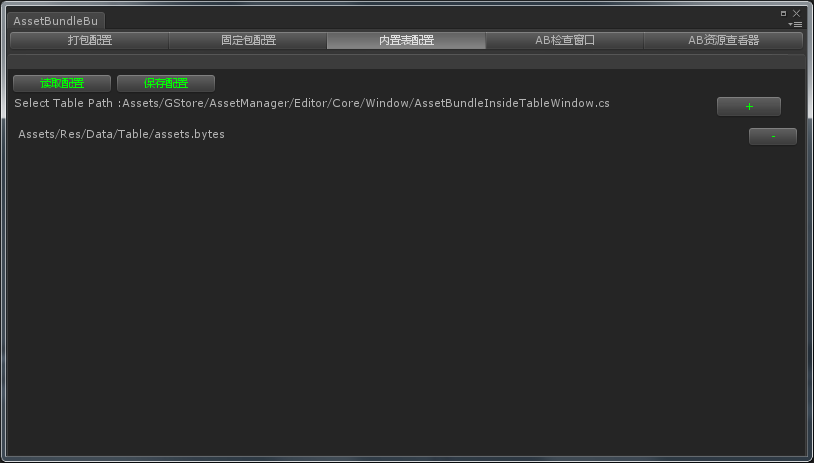
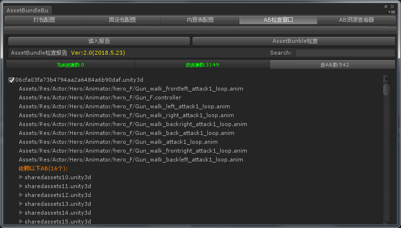
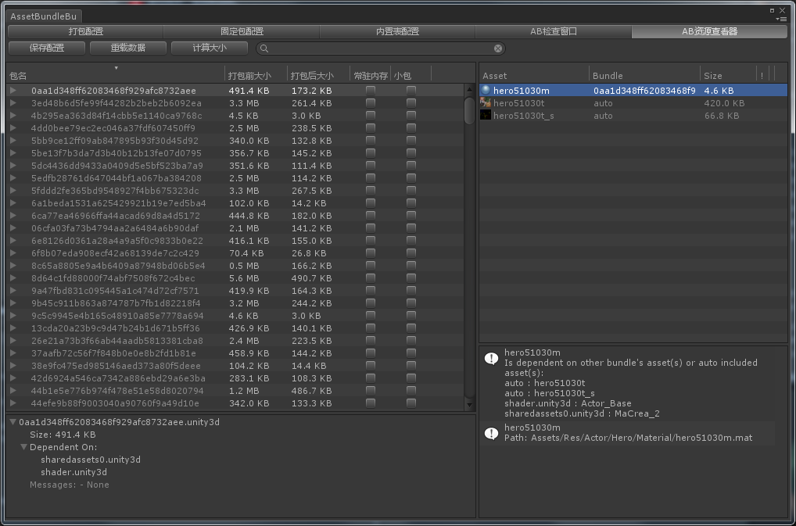
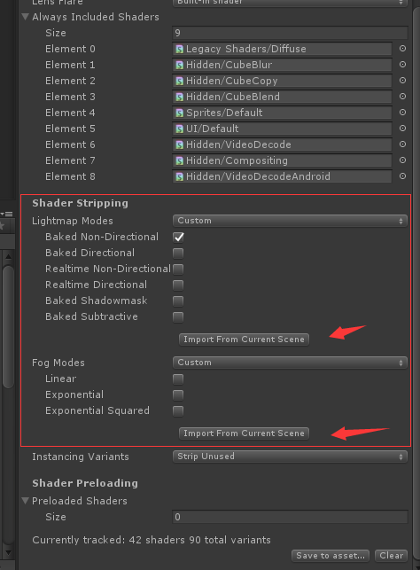

#GStore - AssetManager使用文档
##
* [目录规范和资源命名](#-1)
* [资源打包方案](#0)
* [接入资源管理器到项目中](#1)
* [打包编辑器](#2)
* [固定包编辑器](#3)
* [固定数据编辑器](#4)
* [AssetBundle检查器](#5)
 * [消除资源冗余](#5.1)
* [AssetBundle浏览器](#6)
 * [关于小包模式](#6.1)
* [Shader变体丢失的处理](#7)
 * [烘培场景光照异常](#7.1) 
* [资源管理器接口的使用](#8)

##目录规范和资源命名

###目录规范

- **Res**：项目主要的资源目录，asset表中的所有资源都存放在这个目录，需要打AB的目录。
- **Resources**：项目的固定资源，一定会打进包里的资源，比如资源更新界面的资源。
- **StreamingAssets**：随包发布的资源，一般存放setup.xml，AssetBundles，Data，Lua等。
- **3Part**：存放第三方Unity插件。
- **Plugins**：存放封装好的DLL或其它平台的插件代码。
- **Scenes**：存放所有场景文件。
- **Scripts**：项目代码。

####1. 按逻辑分类

	逻辑分类可以有多级，比如角色下面可以继续分出英雄类和怪物类。

####2. 按资源分类

	如果最后一级逻辑分类只有一种类型的资源文件，可以省略类型分类。

###资源命名

- 资源命名规则：逻辑类型+逻辑编号+资源类型缩写+资源编号(可选)。如：hero51020p#201020
- 资源类型缩写：p代表prefab，m代表material，t代表texture，f代表fbx。
- 大小写限定：文件夹统一首字母大写，文件名统一小写，如有需要，可用“_”号分隔命名。
- 禁止使用中文字符。

##资源打包方案

Unity引擎主要有两个用于打包资源的目录

- ***Resources***：存放在Resources目录的资源及其**依赖资源**，都会被Unity**导入处理**后打包到最终的游戏包中。
- ***StreamingAssets***：存放在StreamingAssets目录的资源，都会**原封不动**地拷贝到最终的游戏包中。

Resources模式虽然使用简单，但是存在着无法热更、无法增量打包、资源过多时增加游戏启动时长等缺点。而StreamingAssets目录需要配合AssetBundle使用获取通过File接口读取解析资源，并且由于StreamingAssets目录对资源不做任何处理，放入其中的资源必须是经过压缩的，否则会有很大的包体占用。

由于Resources目录除了使用方便以外有诸多缺点，不适应后期发布阶段的需求，为了避免发布时再切换资源目录的操作，我们从一开始就要将所有资源使用StreamingAssets目录打包。

游戏中不同的资源类型，我们采用不同的方式打包到最终的游戏包中。

###1.Unity资源
游戏的主要资源，如模型、贴图、材质、prefab、shader等，这类必须通过Unity资源接口加载的资源全部打包成AssetBundle，存放在StreamingAssets目录中。

###2.数据文件
游戏的配置文件，如数据表、AI数据、各种编辑器产生的配置数据，这类数据集中打包成Data.zip，存放在StreamingAssets目录，运行时解压到持久化目录，再通过File接口读取二进制自行解析。这样做能够集中管理数据文件，便于加密和热更，而且压缩率要比打包成AssetBundle高。

###3.Lua文件
Lua文件由于不需要编译，所以可以和数据文件采用同样的打包方式。

###4.视频文件
视频文件通常用于游戏的开场动画，由于视频文件通常都是已压缩的格式，Unity也支持直接读取视频文件而不必通过AssetBundle，所以视频文件直接放在StreamingAssets目录即可。

###5.音频文件
如果项目使用Unity内置的音频播放系统，那么音频文件可以导入成Unity资源，使用AssetBundle的方式打包；如果项目使用类似Wwise的音频引擎，那么可以将该引擎导出的音频数据直接存放在StreamingAssets中。

##接入资源管理器到项目中

资源管理器包含编辑器和运行时两部分的内容。GStore/AssetManager中存放着该模块的代码，项目组不需要改动这部分代码。而GStore-Custom/AssetManager中则存放该模块的一些配置代码，接入模块时需要修改这部分代码。

编辑器部分：

**AssetBundleBuilderInitializer.cs**

运行时部分：

**AssetManagerSetup.cs**

对接代码主要是资源表的对接，编辑器部分对接完即可运行。而运行时代码还需在游戏初始化时调用AssetManagerSetup.Setup()和AssetManager.Instance.Init()。

##打包编辑器
通过点击Unity界面上的菜单**GStore** -> **Build** -> **AssetBundleBuilder**，可以打开打包编辑器。

这个界面主要有两个用途，一是对打包策略进行一些配置：

- **AssetBundle输出路径**：相对于项目工程的路径，通常没有修改的必要。
- **AssetBundle后缀名**：默认.unity3d, 如果修改，运行时代码也需要对应修改。
- **是否合并共享包**：开启后，会根据大小合并共享资源打包，好处是可以调节粒度，简化依赖关系，缺点是文件大小变化可能会引起多个共享包需要重打，影响热更的数据量。建议开启。
- **粒度限制**：仅在开启合并共享包时生效，合并共享包时会参考这个数值控制每个共享包的大小。粒度主要影响IO性能和热更时的流量，推荐值1024.

第二个用途是在此界面进行一些打包操作，可以单步执行也可以一键出包，方便本地打包测试，接入云构建时，云构建会调用一键出包接口完成出包。

##固定包编辑器

固定包配置可以将资源目录下的一些目录添加到打包策略中，主要有以下几个作用：

- 使不在asset表中的资源可以被打包成AssetBundle
- 支持通过路径加载资源
- 支持对一个目录执行LoadAllAsset操作
- 控制目录中的资源是否要合并成一个AssetBundle

*注意：DummyMaterial目录是打包策略用于[Shader变体丢失的处理](#7)的目录，固定包配置中至少要保留这个目录。*

##内置数据编辑器

由于前面我们将所有的数据文件压缩到StreamingAssets存放，那么游戏运行时需要先解压才能开始读取数据表，但是实际上很可能游戏在解压数据前就需要访问数据表了，所以这部分数据表需要特殊处理一下，最终采用的方案是，需要提前读取的数据文件，通过在此界面配置，打包时会复制到Resources目录，确保即使数据未解压也仍有内置的数据可读，由于加载策略中，Resources的优先级最低，所以当数据解压后或者热更后，游戏就不会读取到内置数据了。

##AssetBundle检查窗口

这个界面用于分析打包后的AssetBundle的资源分布和依赖情况，主要用于排查AssetBundle中是否有资源冗余打包的情况。

使用步骤：

1. 首先需要打包AssetBundle。
2. 点击“**AssetBundle检查**”按钮，浏览到AssetBundle的输出目录，确定。
3. 等待分析进度条，这一步目前耗时长，有待优化。
4. 分析完毕后会生成报告并自动打开报告。

###消除资源冗余

我们通过依赖分析进行打包的策略避免了因为assetBundleName设置不当导致项目资源被冗余打包的问题。但是，仍有一些情况是打包策略解决不了的冗余情况:

####Unity**内置资源**的冗余。

由于内置资源无法通过设置assetBundleName来独立打包，那么当内置资源有多处引用时，就会被重复打入多个AssetBundle中，造成冗余。

解决方法：

1. 通过AssetBundle检查器可以查看到内置资源的冗余，通常是诸如UISprite、Default-Material、内置Shader等。
2. 展开含有冗余资源的AssetBundle，可以看到依赖内置资源的资源，修改工程中的该资源，移除对该资源的引用或者替换成项目中的资源。
3. 对于一些仅用于发射子粒子系统，而本身不需要渲染的粒子系统，应该关闭渲染并且删除上面绑定的默认材质。
4. 如果确实要使用内置Shader，可以Unity官网下载对应版本的Shader代码，放入工程中会自动关联。
5. 关于FBX中有默认材质的引用的问题，打包工具做了一些特殊处理来消除冗余。

####Sprite同时作为Texture使用造成冗余。

在实际使用中发现，当一些贴图同时作为Sprite和Texture被其它资源引用时，贴图本身设置了assetBundleName，打包AssetBundle后发现，引用Sprite的资源能正确处理依赖关系没有冗余，而引用Texture的资源包都冗余了一张目标贴图。

目前认为这是Unity打包的一个bug，assetBundleName的设置仅应用在Sprite上而没有应用Texture在对象上。

解决方法：

目前回避这个问题的方法是一张图设置成Sprite就不要再用作Texture，实在需要，则复制一张图仅做Texture使用。 

##AssetBundle浏览器

这个界面直接集成了Unity官方开源的[AssetBundles-Browser](https://github.com/Unity-Technologies/AssetBundles-Browser)，相比AssetBundle检查窗口，这个可以在打包前浏览各个AssetBundle的资源，更加方便，不过排查冗余资源的功能，还是AssetBundle检查器通过分析打包后的AssetBundle更加准确。

我们在官方版本上还做了一些扩展，加上标识“**常驻内存**”和“**小包**”的功能，标注了常驻内存的AssetBundle，在游戏过程中即使切场景也不会卸载，通常用于shader和字体的AssetBundle。而标注小包则用于小包模式。

###小包模式

一方面，对于移动平台来说，有些渠道对游戏的包体大小有限制，一般来说，首包越小的游戏在推广上更有优势。另一方面，随着手游产品越来越重度和追求高品质，包体随之越来越大。为了处理这种矛盾，打包管理器支持小包模式。

小包模式指的时候打包的时候只包含最低限度能运行游戏的资源，其它资源进入游戏后再通过网络下载或者按需下载，从而降低首包大小和兼顾游戏品质。

小包模式的配置：

1. 在AssetBundle浏览器中找到首包需要包含的AssetBundle，通常是字体、Shader、初始化界面等，将其打勾标注成小包。*注意，标识了小包的AssetBundle，其依赖的AssetBundle不管有没有标注都会自动打包进去。*
2. 标注完保存配置，编辑器运行AssetBundle小包模式，测试是否能够顺利进入游戏到达下载资源包的流程，如提示加载AssetBundle失败，则根据提示回到第一步继续标注缺失的资源，直至能够正常进入流程为止。

##Shader变体丢失的处理

如果打包AssetBundle后，发现有材质显示异常，通常是因为Shader的变体被剥离了。解决办法是新建一个包含所需变体的材质或者ShaderVariantsCollection，放置到Assets/Res/DummyMaterial目录，打包工具会自动处理Shader变体的生成。

这里推荐使用ShaderVariantsCollection，通过Unity编辑器运行游戏一段时间，即可收集到绝大部分需要使用到的变体。

###烘培场景光照异常

Unity默认按照BuildSetting和各级Resources目录中用到的资源来自动剥离没有使用到的代码和shader，而使用AssetBundle模式时，Unity无法确定这些资源是否会用到，按照上面的规则会认为没有用到，从而错误的剥离掉一些信息。

如果打包AssetBundle后，发现场景灯光显示异常，则很可能是烘培信息被剥离了，解决方法如下：

1. 打开一个烘培过的场景

2. 打开GraphicSettings：

3. 点击Import From Current Scene。会根据当前场景的烘培设置勾选可以剥离的信息。

4. 提交GraphicSettings的修改。

##资源管理器接口的使用

运行时统一通过GStore.AssetManager.AssetManager提供的接口加载资源。

###资源管理器生命周期接口

####模块初始化

接口：

`public void Init()`

游戏初始化时调用一次。

####通知场景开始

接口：

`public void DoStartScene()`

场景开始时调用。

####通知场景退出

接口：

`public void DoExitScene()`

场景退出时调用。

###资源加载部分

####同步加载资源
接口：

`public T LoadAsset<T>(int assetId) where T : Object`

示例：

`AudioClip clip = AssetManager.Instance.LoadAsset<AudioClip>(assetId);`

####异步加载资源
接口：

`public void LoadAssetAsync(int assetId, ObjectCallback callBack, IsObjectOldFunc func)`

示例：

	AssetManager.Instance.LoadAssetAsync(assetId, delegate (Object obj, bool isOld)
    {
        if (isOld == false && gameObject != null)
        {
            GameObject effectPrefab = obj as GameObject;

            if (effectPrefab == null)
                return;
           
            GameObject effectObject = AssetManager.Instance.Instantiate(effectPrefab);
            mEffect3 = effectObject;

            ShowHitEffect(iActive);
        }
    }, CheckSceneName);

####加载Sprite

接口：

`public Sprite LoadSprite(int assetId, string spriteName = "")`

示例：

`Sprite sprite = AssetManager.Instance.LoadSprite(assetId, name);`

####加载二进制数据

接口：

`public byte[] LoadFileData(string originName)`

示例：

`bytes = GStore.AssetManager.AssetManager.Instance.LoadFileData(resourcePath);`

###GameObject实例化与缓存

####从缓存池获取或实例化GameObject

接口：

`public GameObject Instantiate(GameObject prefab, Vector3 position, Quaternion rotation, bool getFromPool = true)`

示例：

`GameObject cloneUIObj = AssetManager.Instance.Instantiate(uiObj);`

####加载资源并实例化GameObject

接口：

`public GameObject LoadAssetAndInstantiate(int assetId, bool getFromPool = true)`

####异步加载资源并实例化GameObject

接口：

`public void LoadAssetAsyncAndInstantiate(int assetId, GameObjectCallback callBack, IsObjectOldFunc func, bool getFromPool = true)`

####提前生成缓存对象

接口：

`public void CacheObject(int assetId, int cacheNum = 1)`

####回收GameObject到缓存池

接口：

`public void RecycleGameObject(GameObject go)`

