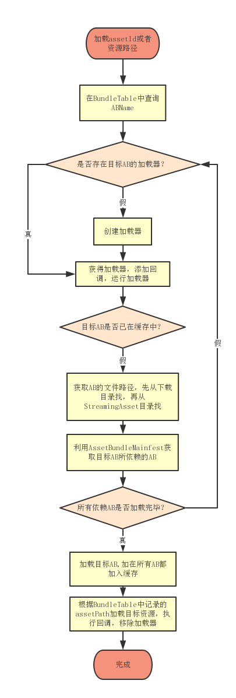

#GStore - AssetManager开发文档
##
* [资源表定义](#0)
* [项目开发中的资源加载方式](#1)
* [AssetBundle打包策略](#2)
 * [设计目标](#2.0)
 * [依赖打包的核心规则](#2.1)
 * [依赖打包的粒度控制](#2.2)
 * [打包策略中的表格](#2.3)
 * [打包策略的具体实现](#2.4)
 * [shader打包的特殊处理](#2.5)
* [运行时开发](#3)
 * [资源加载和卸载](#3.1)
 * [资源内存池](#3.2)

##资源表定义

|ClientDefine|key||||
|:--|:--|:--|:--|:--|
|Info|编号|目录|名字|后缀|
|Type|int|string|string|string|
|Name|id|dir|name|suffix|
|Value|101|UI_Prefab|[UIRoot]|.prefab|
||102|UI_Prefab|[Mask]|.prefab|
||10001|UI_Prefab_GUI|UI_Tips|.prefab|
||10002|UI_Prefab_GUI|UI_TwiceConfirm|.prefab|
||10003|UI_Prefab_GUI|UI_MessageBox|.prefab|

- id：动态加载资源的唯一ID，项目中使用此ID来配置和加载指定资源。
- dir：资源所在的目录，从Res目录开始，使用“_”代替“/”分割子目录。
- name：资源文件名。
- suffix：资源文件名后缀。

##项目开发中的资源加载方式

Unity一共提供了3种在运行过程中动态加载资源的方式。

###**Resources.Load**

	使用方便，只支持Resources目录，无法热更

###**AssetBundle.LoadAsset**

	资源修改需要打包AB后才能看见效果

###**AssetDatabase.Load**

	支持工程中的任意路径，仅编辑器下可用，没有异步加载接口

结合这三种加载方式的优点和局限性，我们制定了开发过程中的资源加载规则：

- 真机上使用AssetBundle + Resources两种方式加载资源，Res目录的资源只能通过AssetBundle加载。真机出包必须打包AssetBundle。

- 编辑器环境使用AssetDatabase.Load加载Res目录的资源，不需要打包AssetBundle即可直接加载资源达到与Resources.Load一样的便利。

- 通过修改配置文件，控制编辑器环境下也可以通过AssetBundle加载资源，用于调试AB加载问题，模拟真机模式。

- 加载顺序：AssetBundle（如果开启） -> AssetDatabase（仅编辑器） -> Resources。

如此，开发过程依然便利，不必处理AssetBundle相关事务即可直接看到资源修改的效果，发布真机时才由打包编辑器将资源打包成AssetBundle，支持热更和加密等。

TODO 补充代码部分

##AssetBundle打包策略

###设计目标

- 零冗余
- 粒度控制
- AssetBundle间依赖合理，资源内聚
- 无需人为维护，部署完成后，开发中不需要关心如何打包AssetBundle

###依赖打包的核心规则

- **Unity5.x以后的打包规则：设置了assetBundleName的资源会独立打包，依赖资源如果也设置了assetBundleName则会建立AssetBundle间的依赖关系，依赖资源如果没有assetBundleName则会被收集到引用它的资源包中打包成同一个assetBundle中。**

基于以上提到的规则，我们的打包策略主要解决几个问题：

- 需要动态加载的资源通过设置assetBundleName或者被有assetBundleName的资源依赖才能被打包成AssetBundle。当这个资源不需要动态加载时，可以自动清除掉assetBundleName，避免打包无用的资源。

- 当依赖资源被多个assetBundleName的资源依赖时，该资源会被重复收集到不同的AssetBundle中造成资源冗余打包，要避免这种情况，则该资源应当设置assetBundleName。

- AssetBundle粒度问题，一般来说，AssetBundle的粒度越低，AssetBundle的数量就越多，AssetBundle间的依赖关系也越多，加载一个prefab可能需要加载数百个依赖的AssetBundle，这会造成IO和加载代码上的额外开销，而且AssetBundle在内存中的序列化大小占用也会较多；另一方面，如果AssetBundle粒度很大，那么如果需要热更新一个小文件，则可能会需要更新一整个大的AssetBundle，造成过多额外流量开销。根据经验，AssetBundle的粒度大小在1MB左右的时候，各方面的开销都比较合理。所以打包策略中需要实现一定程度的粒度控制。

###依赖打包的粒度控制

粒度控制主要有两个思路来做：

- 一是将依赖资源合并到引用它的资源中，即如果资源A依赖资源B，则将B收集到资源A的AssetBundle包中。这一点利用Unity的打包规则来做就是依赖资源不设置assetBundleName即可，还可以减少AssetBundle间的依赖数。但是结合上面提到的第2点要避免冗余，被多个资源引用的资源还是要另外设置assetBundleName，不建议这么做。

- 二是依赖资源与依赖资源进行合并。根据上面所说的原则，为了避免冗余打包，有多个引用的资源都会要求设置assetBundleName独立打包，我们可以将没有下一级依赖的资源(通常是贴图、动画、模型)进行合并，注意这里只合并没有下级依赖的资源，因为如果合并的资源有其它依赖，加载时会造成不必要的依赖加载，举例一个贴图如果和一个有复杂依赖的预制体合并在一个AssetBundle中，那么加载这个贴图时，需要先加载这个AssetBundle的依赖包，但我们实际要加载的贴图并不需要那些依赖包，造成无意义的开销。

总结最终粒度控制结合上面两个思路来做的，首先，可以通过依赖关系合并的资源则通过依赖关系合并，在不造成冗余的前提下，一个AssetBundle尽可能包含它所依赖的资源，这样粒度大，AssetBundle划分稳定，AssetBundle间依赖少，加载便捷，是比较理想的合并方式；其次，对于无法通过依赖关系合并的具有多个引用的依赖资源，我们称之为共享资源，共享资源都在依赖树的最基层，没有下一级依赖，多个共享资源可以有策略地合并成若干个共享包，这一步我们可以通过文件大小和文件类型，估算打包成AssetBundle后的大小，根据估值来合并共享资源，将每个共享包的大小都控制在1MB左右的理想大小，既优化了粒度，又简化了AssetBundle间的依赖。

这个方案通过分析资源间的依赖关系实现了没有人为干涉的情况下合理的粒度控制。

*注：合并共享包有一个潜在的缺点，就是文件大小会影响分包结果，假如有个资源修改后文件增大了许多，造成此共享包的一些文件需要打包到下一个共享包中，则可能造成连续多个共享包需要重新打包，如果在热更新时发生这种情况则会造成大量不必要的流量消耗。不过，当游戏进入发布热更的阶段时，资源文件的大小应该是相当稳定的，即使有修改，文件大小也基本不会有太大变化，触发这个问题的风险极低，而合并共享包的收益明显更大。*

###打包策略中的表格

为了实现上面提到的，保证需要动态加载的资源都能被打包成AssetBundle，我们首先设计了asset表的使用，为需要动态加载的资源设定一个id，这样做主要有两个好处，一是项目开发中无论写代码还是填写编辑器数据，需要填写资源的时候使用id代替路径更加简洁高效；二是动态加载的资源都集中在一张表管理，我们的打包策略可以以这张表开始进行依赖分析。

asset表的做法在大多数情况下相比使用路径加载的方式都是更优的，但是不好处理项目有时候是使用拼接路径进行加载资源的方式，拼接路径的方式虽然管理上有些不便，但也有其便利的应用场景，比如利用一个角色名，拼接出该角色的头像路径、大图路径、live2D路径等，简化了添加一个角色资源需要在asset表中添加多个资源id的操作。所以我们设计了固定AB配置表，这个表有几个用途：一是能够将没有assetId但是同样需要动态加载的资源记录起来设置assetBundleName，通过路径加载，这个作用上来讲是asset表的补充。二是可以设置某个目录下的所有资源合并打包成一个AssetBundle，作为人工调整AssetBundle粒度的一个手段。

为了灵活的处理资源和AssetBundle之间的关系和粒度控制，我们使用一张BundleTable来记录每个需要动态加载的资源在哪一个AssetBundle中，资源索引可以是assetId也可以是assetPath，映射关系可以是一对一也可以是多对一，加载资源时使用资源索引在此表中查询即可，非常灵活和方便。

**Asset表**

人工维护的excel表格，记录assetId到资源路径的对应关系，项目中主要通过assetId动态加载资源

**固定AB配置表**

使用AB编辑器人工维护的xml配置表，记录需要一起打AB的指定的路径，用于调整打包粒度，同时实现通过路径加载资源。

**BundleTable**

分析项目资源依赖关系后自动生成的json数据表，记录assetId或者资源路径与所在AB的对应关系，运行时需要在这个表格中查询目标资源存放在哪个AB中。

###打包策略的具体实现

根据上面提到的规则和思路，打包策略实现的主要代码如下：

####1. 读入索引资源

索引资源 = asset表资源 + 固定AB表资源

索引资源是项目中直接要加载的资源，第一步要把所有索引资源统计出来，然后确保索引资源都能被打包成AssetBundle。

<pre class="brush:csharp">
private static bool ReadAssetTable()
{
    try
    {
        //删除持久化目录的数据，确保读表的信息最新
        if (Directory.Exists(AssetPathDefine.externalFilePath))
        {
            Directory.Delete(AssetPathDefine.externalFilePath, true);
        }

        //加载资源表
        BundleEditor.AssetInfo.Load(true);
    
        var enumerator = BundleEditor.AssetInfo.GetEnumerator();
        while (enumerator.MoveNext())
        {
            BundleEditor.AssetInfo data = enumerator.Current.Value;
            if (File.Exists(data.assetPath) == false)
            {
                m_MissingAssetList.Add(data.id.ToString(), data.assetPath);
                continue;
            }
            m_AssetInfoList.Add(data);
    
            string key = data.assetPath;
            int id = 0;
            if (m_AssetNameDict.TryGetValue(key, out id))
            {
                Debug.LogWarningFormat("{0} already exists, last_id={1}, now_id={2}", key, id, data.id);
                continue;
            }
    
            m_AssetNameDict.Add(data.assetPath, data.id);
        }
        enumerator.Dispose();
    
        if (m_MissingAssetList.Count > 0)
        {
            string json = JsonUtil.ToPrettyJson(m_MissingAssetList);
            string recordFilePath = AssetBundleSettingManager.Instance.setting.missingAssetRecordFile;
            File.WriteAllText(recordFilePath, json, System.Text.Encoding.UTF8);
            RecordModifyFile(recordFilePath, false);
            Debug.LogWarningFormat("asset表有{0}个资源丢失！已生成记录文件：{1}", m_MissingAssetList.Count, recordFilePath);
        }
    
        return true;
    }
    catch (System.Exception e)
    {
        EditorTools.ClearProgressBar();
        Debug.LogError("Step:ReadAssetTable error!");
        Debug.LogException(e);
        return false;
    }
}
</pre>

####2. 统计资源依赖

遍历所有索引资源，通过AssetDatabase.GetDenpendencies(string assetPath, bool recursive)接口获取每一个索引资源的依赖资源，记录形成一张所有依赖资源的引用查询表，为后面的打包策略服务。

**recursive参数的选择：**

假设A.prefab和B.prefab都依赖C.controller，C.controller依赖D.anim和E.anim。

那么，当recursive = true的时候，获取A的依赖会得到CDE，获取B的依赖也得到CDE，CDE都有两个资源引用，不能被依赖打包。

当recursive = false的时候，获取A的依赖会得到C，获取B的依赖也得到C，这时想要得到完整的依赖关系还需要获取C的依赖，会得到DE，那么结果就是，C有两个资源引用，不能被依赖打包，而DE只被C引用，可以被依赖打包到C的AssetBundle包中。

所以，选择recursive = false，需要分层获取依赖，但是统计的依赖关系更合理，使中间层依赖资源也能进行依赖打包，分包更合理。

<pre class="brush:csharp">
private static bool InitReferenceCounter()
{
    try
    {
        for (int i = 0; i &lt; m_AssetInfoList.Count; i++)
        {
            BundleEditor.AssetInfo info = m_AssetInfoList[i];
            string assetPath = info.assetPath;

            EditorTools.DisplayProgressBar(string.Format("InitReferenceCounter ({0}/{1})", i + 1, m_AssetInfoList.Count), assetPath, (float)(i + 1) / m_AssetInfoList.Count);
    
            if (File.Exists(assetPath) == false)
            {
                continue;
            }
            RecordAssetReference(assetPath);
        }
    
        //分析固定包的引用
        InitFixedReferenceCounter();
    
        EditorTools.ClearProgressBar();
        return true;
    }
    catch (System.Exception e)
    {
        EditorTools.ClearProgressBar();
        Debug.LogError("Step:InitReferenceCounter error!");
        Debug.LogError(e.ToString());
        return false;
    }
}

private static void RecordAssetReference(string assetPath)
{
    if (m_AssetReferenceRecordedSet.Add(assetPath) == false)
    {
        //已处理过，跳出递归，防止循环引用。
        return;
    }

    bool recursive = AssetBundleSettingManager.Instance.setting.recursiveReferenceMode;
    
    string[] deps = AssetDatabase.GetDependencies(assetPath, recursive);
    
    foreach (string d in deps)
    {
        if (Path.GetExtension(d).Equals(".cs")) //跳过c#脚本
        {
            continue;
        }
        if (File.Exists(d) == false)
        {
            continue;
        }
    
        HashSet&lt;string&gt; refSet = null;
        if (m_AssetReferenceCounter.TryGetValue(d, out refSet) == false)
        {
            refSet = new HashSet&lt;string&gt;();
            m_AssetReferenceCounter[d] = refSet;
        }
    
        refSet.Add(assetPath);
    
        //如果不是递归引用，还要纪录下一级引用
        if (recursive == false)
        {
            RecordAssetReference(d);
        }
    }
}
</pre>

####3. 设置固定包assetBundleName

分析完依赖表后，就要开始设置assetBundleName了，固定包的优先级最高，因为固定包也可以用来作为人为控制AssetBundle分包的一个手段。

<pre class="brush:csharp">
private static bool SetFixedAssetBundleName()
{
    try
    {
        List&lt;BundleEditor.BundleNodeModel&gt; infos = FixedBundleManager.Instance.bundles.notes;
        int length = infos.Count;
        for (int i = 0; i &lt; length; i++)
        {
            BundleEditor.BundleNodeModel pair = infos[i];
            EditorTools.DisplayProgressBar(string.Format("SetFixedAssetBundleName:({0}/{1})", i.ToString(), length.ToString()), pair.folder, (float)(i) / length);

            string dir = AssetPathDefine.resFolder + pair.folder;
            List&lt;string&gt; paths = new List&lt;string&gt;();
    
            if (Directory.Exists(dir))
            {
                GetFiles(dir, new string[] { ".meta", ".cs", ".DS_Store" }, ref paths);
            }
            else
            {
                Debug.LogError("Not Exists Dir: " + pair.folder);
            }
    
            string abName = string.Concat(pair.folder.ToLower().Replace('\\', '/'), AssetBundleSettingManager.Instance.setting.assetBundleExtension);
            abName = abName.Replace("/", "_");
    
            for (int j = 0; j &lt; paths.Count; j++)
            {
                string path = paths[j];
                AssetImporter importer = AssetImporter.GetAtPath(path);
    
                if (importer == null)
                {
                    Debug.LogError("can not import : " + path);
                    return false;
                }
    
                string assetPath = importer.assetPath;
    
                //处理Dummy Material, 用于控制shader编译的变体
                string fileName = Path.GetFileName(assetPath);
                if (fileName.StartsWith("dummy"))
                {
                    //添加支持shadervariants
                    if (fileName.EndsWith(".mat") || fileName.EndsWith(".shadervariants"))
                    {
                        abName = AssetBundleSettingManager.Instance.setting.shaderAssetBundleName;
                        RecordAssetBundleName(importer, abName);
                        continue;
                    }
                }
    
                //分割打包需要独立的abName
                if (pair.isSplit)
                {
                    abName = GenerateUniqueABName(assetPath);
                }
    
                RecordAssetBundleName(importer, assetPath, abName);
            }
            //支持LoadAll
            BundleTableCreateMgr.Instance.RecordBundleName(dir, dir, abName);
        }
        EditorTools.ClearProgressBar();
        return true;
    }
    catch (System.Exception e)
    {
        EditorTools.ClearProgressBar();
        Debug.LogError("Step:SetFixedAssetBundleName error!");
        Debug.LogError(e.ToString());
        return false;
    }
}
</pre>

####4. 设置索引资源assetBundleName

设置完固定包资源的assetBundleName后，就是设置assetId表资源的assetBundleName了，这两步做完，可以保证需要动态加载的资源都会被打包成AssetBundle。

<pre class="brush:csharp">
private static bool SetAssetBundleName()
{
    try
    {
        int count = m_AssetInfoList.Count;
        int value = 0;
        foreach (var info in m_AssetInfoList)
        {
            string assetPath = info.assetPath;
            EditorTools.DisplayProgressBar(string.Format("SetAssetBundle:({0}/{1})", ++value, count), assetPath, (float)(value) / count);
            string abName = string.Empty;
            if (m_AssetPathDict.TryGetValue(assetPath, out abName))//该资源已经设置了，这里可能是固定包设置了，也可能是有不同id指向同一个资源，也可能是依赖包那边设置了
            {
                //使用之前设置的abName，添加一条记录
                BundleTableCreateMgr.Instance.RecordBundleName(info.id.ToString(), assetPath, abName);
                continue;
            }

            AssetImporter importer = AssetImporter.GetAtPath(assetPath);
            assetPath = importer.assetPath;
            if (importer == null)
            {
                Debug.LogError("can not import : " + assetPath);
                return false;
            }
    
            if (Path.GetExtension(assetPath).Equals(".shader"))
            {
                abName = AssetBundleSettingManager.Instance.setting.shaderAssetBundleName;
            }
            else
            {
                abName = string.Concat(info.id, AssetBundleSettingManager.Instance.setting.assetBundleExtension);
            }
    
            RecordAssetBundleName(importer, info.id.ToString(), abName);
        }
    
        return true;
    }
    catch (System.Exception e)
    {
        EditorTools.ClearProgressBar();
        Debug.LogError("Step:SetAssetBundleName error!");
        Debug.LogError(e.ToString());
        return false;
    }
}
</pre>

####5. 设置依赖资源assetBundleName

索引资源设置完毕后，需要设置依赖资源的assetBundleName，否则打包会有资源冗余。这一步确保清空单引用资源，让其可以被依赖打包收集，然后记录多引用资源，收集多引用资源用于下一步合并共享包。

<pre class="brush:csharp">
private static bool SetDependenceABName()
{
    int count = m_AssetReferenceCounter.Count;
    int value = 0;

    Dictionary&lt;string, HashSet&lt;string&gt;&gt;.Enumerator enumerator = m_AssetReferenceCounter.GetEnumerator();
    
    while (enumerator.MoveNext() != false)
    {
        KeyValuePair&lt;string, HashSet&lt;string&gt;&gt; pair = enumerator.Current;
    
        EditorTools.DisplayProgressBar(string.Format("SetDepAssetBundle:({0}/{1})", ++value, count), pair.Key, (float)(value) / count);
    
        string assetPath = pair.Key;
    
        if (m_AssetPathDict.ContainsKey(assetPath))
        {
            //该资源已设置过abName，所以跳过
            continue;
        }
    
        string abName = string.Empty;
        AssetImporter importer = AssetImporter.GetAtPath(assetPath);
        if (importer == null)
        {
            Debug.LogError("can not import : " + assetPath);
            //这一步可能是Reimport触发一些资源脚本删除掉一些资源
            continue;
            //return false;
        }
    
        if (Path.GetExtension(assetPath).Equals(".shader")) //shader集中打包
        {
            abName = AssetBundleSettingManager.Instance.setting.shaderAssetBundleName;
        }
        else
        {
            if (pair.Value.Count &gt; 1)  //5.被引用大于1的资源
            {
                if (AssetBundleSettingManager.Instance.setting.combineDependenceAssetBundle)
                {
                    string[] deps = AssetDatabase.GetDependencies(assetPath, false);
                    //只合并没有下一层依赖的资源
                    if (deps.Length == 0)
                    {
                        //记录到下一步合并
                        m_CombineFileList.Add(importer);
                        continue;
                    }
                }
    
                abName = GenerateUniqueABName(assetPath);
            }
            else    //6.被引用小于等于1的资源不用打包，这一步可以去除由于依赖关系改变而不需要打ab的资源
            {
                if (string.IsNullOrEmpty(importer.assetBundleName) == false)
                {
                    RecordModifyFile(assetPath);
                }
                importer.assetBundleName = "";
                continue;
            }
        }
    
        //记录依赖资源
        RecordAssetBundleName(importer, abName);
    }
    return true;
}
</pre>

####6. 合并依赖包

这一步处理所有无依赖的基础资源，估算打包后的大小，根据估值和粒度控制值进行分包合并。至此，从打包策略层面上消除了资源冗余的问题和实现了共享包的粒度控制。

<pre class="brush:csharp">
private static bool CombineDependenceAB()
{
    System.Diagnostics.Stopwatch sw = new System.Diagnostics.Stopwatch();
    sw.Start();

    int count = m_CombineFileList.Count;
    int value = 0;
    
    long sizeLimit = AssetBundleSettingManager.Instance.setting.finenessLimit * 1024;
    long combineSize = 0;
    string abName = string.Empty;
    int combineABCount = 0;
    foreach (AssetImporter importer in m_CombineFileList)
    {
        if (importer == null)
        {
            continue;
        }
    
        EditorTools.DisplayProgressBar(string.Format("CombineDependenceAssetBundle:({0}/{1})", ++value, count), importer.assetPath, (float)(value) / count);
    
        //读取文件大小
        long size = GetAssetSize(importer);
        if (size &gt;= sizeLimit)
        {
            //单文件超出限制，单独打包
            RecordAssetBundleName(importer, GenerateUniqueABName(importer.assetPath));
            combineABCount++;
            continue;
        }
    
        //生成新包名
        if (string.IsNullOrEmpty(abName))
        {
            abName = GenerateSharedABName();
            combineABCount++;
        }
    
        RecordAssetBundleName(importer, abName);
    
        //达到大小限制，合下一个包
        combineSize += size;
        if (combineSize &gt;= sizeLimit)
        {
            combineSize = 0;
            abName = string.Empty;
        }
    }
    
    EditorTools.ClearProgressBar();
    
    sw.Stop();
    Debug.LogWarningFormat("合并依赖包：{0}-&gt;{1}, Cost Time:{2}", count, combineABCount, sw.Elapsed.ToString());
    
    return true;
}
</pre>

####7. 清除无用assetBundleName

清除上一次打包在本次打包中无用的assetBundleName，这可能是由于依赖关系变化获取分包策略不同导致分包结果不同，这些遗留的assetBundleName需要清理，否则打包出来就是冗余资源或者造成依赖关系错误。

<pre class="brush:csharp">
private static bool ClearUnusedBundleName()
{
    string[] bundleNames = AssetDatabase.GetAllAssetBundleNames();
    foreach (string abName in bundleNames)
    {
        if (m_ABNameSet.Contains(abName) == false)
        {
            if (IsCommitModify())
            {
                string[] assetPaths = AssetDatabase.GetAssetPathsFromAssetBundle(abName);
                foreach (string assetPath in assetPaths)
                {
                    RecordModifyFile(assetPath);
                }
            }

            AssetDatabase.RemoveAssetBundleName(abName, true);
            Debug.LogWarning("RemoveUnusedABName: " + abName);
        }
    }
    AssetDatabase.RemoveUnusedAssetBundleNames();
    return true;
}
</pre>

####7. 打包AssetBundle

确保assetBundleName全部正确后，调用Unity API打包。

<pre class="brush:csharp">
public static bool BuildAB()
{
    System.Diagnostics.Stopwatch sw = new System.Diagnostics.Stopwatch();
    sw.Start();

    BuildAssetBundleOptions op = BuildAssetBundleOptions.DeterministicAssetBundle;
    if (AssetBundleSettingManager.Instance.setting.compressionType == AssetBundleBuildSetting.CompressionType.LZ4)
        op |= BuildAssetBundleOptions.ChunkBasedCompression;
    else if (AssetBundleSettingManager.Instance.setting.compressionType == AssetBundleBuildSetting.CompressionType.Uncompressed)
        op |= BuildAssetBundleOptions.UncompressedAssetBundle;
    
    string outputFolder = AssetBundleSettingManager.Instance.setting.GetPlatformOutputFolder(EditorUserBuildSettings.activeBuildTarget);
    if (Directory.Exists(outputFolder) == false)
    {
        Directory.CreateDirectory(outputFolder);
    }
    
    //调用Unity API
    BuildPipeline.BuildAssetBundles(outputFolder, op, EditorUserBuildSettings.activeBuildTarget);
    
    //命令行模式减少日志堆栈
    if (UnityEditorInternal.InternalEditorUtility.inBatchMode)
    {
        Application.SetStackTraceLogType(LogType.Log, StackTraceLogType.None);
        Application.SetStackTraceLogType(LogType.Warning, StackTraceLogType.None);
    }
    
    sw.Stop();
    Debug.LogWarningFormat("打包AB耗时：{0}", sw.Elapsed.ToString());
    
    //打包后清理无用的资源
    ClearOutpath();
    
    return true;
}
</pre>

####8. 清除无用AssetBundle

清理输出路径中无用的AssetBundle，原因同第6步。

<pre class="brush:csharp">
private static void ClearOutpath()
{
    System.Diagnostics.Stopwatch sw = new System.Diagnostics.Stopwatch();
    sw.Start();

    int count = 0;
    int value = 0;
    
    //清理无用包
    string[] allAssetBundleName = AssetDatabase.GetAllAssetBundleNames();
    
    string outpath = AssetBundleSettingManager.Instance.setting.GetPlatformOutputFolder(EditorUserBuildSettings.activeBuildTarget);
    List&lt;string&gt; allBundleFile = new List&lt;string&gt;();
    GetFiles(outpath, new string[] { "", ".manifest", ".meta", ".json", "xml" }, ref allBundleFile);
    count = allBundleFile.Count;
    value = 0;
    
    for (int i = 0; i &lt; allBundleFile.Count; i++)
    {
        string bundlePath = allBundleFile[i];
        EditorTools.DisplayProgressBar("Clear", bundlePath, 0.5f * (++value) / count + 0.5f);
        string str = bundlePath.Replace("\\", "/").Replace(outpath, string.Empty);
        if (!allAssetBundleName.Contains(str))
        {
            Debug.LogWarning(string.Format("Delete: {0}", bundlePath));
            File.Delete(bundlePath);
            string str1 = string.Format("{0}.manifest", bundlePath);
            if (File.Exists(str1))
                File.Delete(str1);
        }
    }
    
    //清理无用文件夹
    List&lt;string&gt; allDir = new List&lt;string&gt;();
    GetDirs(outpath, ref allDir);
    allDir.Sort();
    for (int i = 0; i &lt; allDir.Count; i++)
    {
        string path = allDir[i];
        if (!Directory.Exists(path))
            continue;
        if (Directory.GetDirectories(path).Length != 0 || Directory.GetFiles(path).Length != 0)
            continue;
        Directory.Delete(path);
    }
    
    EditorTools.ClearProgressBar();
    sw.Stop();
    Debug.LogWarningFormat("清理输出文件夹, 耗时:{0}", sw.Elapsed.ToString());
}
</pre>

###shader打包的特殊处理

shader是非常特殊的一类资源，有着和其他资源不同的一些特点：

- 使用代码开发，运行时需要编译，但是属于资源文件，可以热更。
- 源文件小，但是由于变体数量不定，编译打包后可能很巨大。
- 运行时初次加载编译耗时大，通常需要提前加载。

由于shader资源的特殊以及为了方便运行时的管理和优化，我们将需要动态加载的shader资源都集中打包成一个AssetBundle包：shader.unity3d

####shader缺少变体的问题

shader有两种定义变体的方式，**multi_compile** 和 **shader_feature**

使用**multi_compile**定义keywork，Unity编译时一定会生成该shader的所有变体版本。

而使用**shader_feature**定义keywork，Unity编译时会根据实际有使用到的keyword来生成部分变体版本。

显然，使用**shader_feature**可以实现按需编译生成变体更合理。这个机制在使用Resources模式打包资源时可以正确工作，但是，当shader单独打包在AssetBundle中时，Unity就无法得知哪些keywork使用到了，从而造成打包出来的shader缺少变体显示异常。

经测试，Unity只会在shader所在的AssetBundle中分析keyword是否有被使用，所以我们使用DummyMaterial文件夹来控制shader的变体。

**DummyMaterial：**
知道Unity识别keyword的机制后，我们可以通过放置一些勾选了特定keyword的material放到DummyMaterial文件夹，打包策略会将其一起打包到shader.unity3d中，从而可以控制shader的变体生成。但是如果项目有变体的shader较多，需要放置material也多，使用不便。我们还可以新建一个ShaderVariantCollection，在游戏运行时收集所有shader变体组合，保存到DummyMaterial文件夹中，也可以被打包到shader.unity3d中控制所有shader变体的生成，推荐使用这种方式。

####cginc文件修改后，shader不更新的问题

由于Unity并不处理shader和cginc文件之间的依赖关系，仅在编译shader时从cginc中抽取特定的代码加入到shader代码中编译，所以，一旦shader.unity3d生成后，再修改cginc文件，增量打包系统无法识别到shader.unity3d需要重新打包，最终真机包修改没有生效。

针对这个问题，我们编写了一个编辑器脚本，通过OnPostprocessAllAssets接口监听cginc文件的导入，然后通过正则匹配搜索有依赖关系的cginc文件，再匹配依赖这些cginc的所有shader，重新导入shader触发编译，然后删除shader.unity3d和shader.unity3d.manifest文件，强制触发重新打包shader包。

*注：修复这个问题主要有两步，第一步是触发shader重新编译，测试中发现，若shader文件与cginc文件在同一个目录下，修改cginc文件时，unity是会自动重新导入该目录的shader文件，从而触发编译shader，但其它目录的shader就没有更新了；第二步，需要删除shader.unity3d和shader.unity3d.manifest文件，这是因为，就算shader重新编译了，到时shader文件和meta文件都没有改变，Unity增量打包系统依然无法感知到这个AssetBundle包需要重新打，所以只能删除文件，让打包系统重新生成。*

**ShaderImportSettings.cs**
<pre class="brush:csharp">
using System.Collections.Generic;
using System.Text.RegularExpressions;
using UnityEditor;
using System.IO;

/// &lt;summary&gt;
/// 自动重导shader
/// &lt;/summary&gt;
public class ShaderImportSettings : AssetPostprocessor
{
    /// &lt;summary&gt;
    /// 自动导入shader
    /// &lt;/summary&gt;
    /// &lt;param name="importedAssets"&gt;&lt;/param&gt;
    /// &lt;param name="deletedAssets"&gt;&lt;/param&gt;
    /// &lt;param name="movedAssets"&gt;&lt;/param&gt;
    /// &lt;param name="movedFromAssetPaths"&gt;&lt;/param&gt;
    static void OnPostprocessAllAssets(string[] importedAssets, string[] deletedAssets, string[] movedAssets, string[] movedFromAssetPaths)
    {
        List&lt;string&gt; cgincList = null;
        foreach (var assetPath in importedAssets)
        {
            if (assetPath.EndsWith(".cginc") == false)
            {
                continue;
            }

            if (cgincList == null)
            {
                cgincList = new List&lt;string&gt;();
            }
    
            cgincList.Add(assetPath);
        }
        if (cgincList == null || cgincList.Count == 0)
        {
            return;
        }
        System.Diagnostics.Stopwatch sw = new System.Diagnostics.Stopwatch();
        sw.Start();
    
        //加上依赖的文件
        cgincList = FindCgincReferences(cgincList);
    
        HashSet&lt;string&gt; regexList = new HashSet&lt;string&gt;();
        foreach (string assetPath in cgincList)
        {
            regexList.Add(GetRegexPattern(assetPath));
        }
    
        //获取所有打AB的shader
        List&lt;string&gt; shaderList = GetAllShadersFromAssetBundle();
        if (shaderList == null || shaderList.Count == 0)
        {
            return;
        }
    
        HashSet&lt;string&gt; matchShaderSet = new HashSet&lt;string&gt;();
        foreach (string assetPath in shaderList)
        {
            string text = File.ReadAllText(assetPath);
            //匹配cginc文件
            foreach (string regex in regexList)
            {
                if (Regex.IsMatch(text, regex))
                {
                    matchShaderSet.Add(assetPath);
                    break;
                }
            }
        }
        if (matchShaderSet.Count == 0)
        {
            return;
        }
    
        foreach (string assetPath in matchShaderSet)
        {
            Debug.LogFormat("Reimport:{0}", assetPath);
            AssetDatabase.ImportAsset(assetPath);
        }
    
        //删除AB以触发重打
        AssetBundleBuildTools.ClearShaderAB();
    
        sw.Stop();
        Debug.LogFormat("检测到cginc文件修改，自动更新{0}个关联shader, 耗时：{1}", matchShaderSet.Count, sw.Elapsed.ToString());
    }
    
    /// &lt;summary&gt;
    /// 获取所有设置了ABName的shader
    /// &lt;/summary&gt;
    /// &lt;returns&gt;&lt;/returns&gt;
    private static List&lt;string&gt; GetAllShadersFromAssetBundle()
    {
        List&lt;string&gt; list = new List&lt;string&gt;();
        string[] assetPaths = AssetDatabase.GetAssetPathsFromAssetBundle(AssetBundleSettingManager.Instance.setting.shaderAssetBundleName);
        foreach (string assetPath in assetPaths)
        {
            if (assetPath.EndsWith(".shader") == false)
            {
                continue;
            }
            list.Add(assetPath);
        }
        return list;
    }
    
    /// &lt;summary&gt;
    /// 获取所有cginc文件
    /// &lt;/summary&gt;
    /// &lt;returns&gt;&lt;/returns&gt;
    private static Dictionary&lt;string, string&gt; GetAllCgincTexts()
    {
        Dictionary&lt;string, string&gt; dict = new Dictionary&lt;string, string&gt;();
        string[] assetPaths = AssetDatabase.GetAllAssetPaths();
        foreach (string assetPath in assetPaths)
        {
            if (assetPath.EndsWith(".cginc") == false)
            {
                continue;
            }
            dict.Add(assetPath, File.ReadAllText(assetPath));
        }
        return dict;
    }
    
    /// &lt;summary&gt;
    /// 获取依赖cginc
    /// &lt;/summary&gt;
    /// &lt;param name="sourceList"&gt;&lt;/param&gt;
    /// &lt;returns&gt;&lt;/returns&gt;
    private static List&lt;string&gt; FindCgincReferences(List&lt;string&gt; sourceList)
    {
        List&lt;string&gt; resultSet = new List&lt;string&gt;();
        FindCgincReferences(sourceList, resultSet, GetAllCgincTexts());
        return resultSet;
    }
    
    /// &lt;summary&gt;
    /// 获取依赖cginc
    /// &lt;/summary&gt;
    /// &lt;param name="sourceList"&gt;&lt;/param&gt;
    /// &lt;param name="allCginc"&gt;&lt;/param&gt;
    /// &lt;returns&gt;&lt;/returns&gt;
    private static void FindCgincReferences(List&lt;string&gt; sourceList, List&lt;string&gt; resultList, Dictionary&lt;string, string&gt; allCginc)
    {
        foreach (var source in sourceList)
        {
            resultList.Add(source);
            allCginc.Remove(source);
        }
    
        List&lt;string&gt; depList = new List&lt;string&gt;();
        foreach (var kvp in allCginc)
        {
            foreach (var source in sourceList)
            {
                if (Regex.IsMatch(kvp.Value, GetRegexPattern(source)))
                {
                    depList.Add(kvp.Key);
                    break;
                }
            }
        }
        if (depList.Count &gt; 0)
        {
            //搜索下一级引用
            FindCgincReferences(depList, resultList, allCginc);
        }
    }
    
    /// &lt;summary&gt;
    /// 获取正则表达式
    /// &lt;/summary&gt;
    /// &lt;param name="assetPath"&gt;&lt;/param&gt;
    /// &lt;returns&gt;&lt;/returns&gt;
    private static string GetRegexPattern(string assetPath)
    {
        return Path.GetFileName(assetPath);
    }
}
</pre>

##运行时开发

运行时实现了**AssetBundle**、**Resources**、**AssetDatabase**三种资源加载方式。

游戏中需要加载资源时，不需要关心使用哪种加载方式，统一调用**AssetManager.Instance.LoadAsset(int assetId)**即可，资源管理器内部会自动选取合适的加载方式。

<pre class="brush:csharp">
        /// &lt;summary&gt;
        /// 加载资源
        /// &lt;/summary&gt;
        /// &lt;typeparam name="T"&gt;&lt;/typeparam&gt;
        /// &lt;param name="assetId"&gt;&lt;/param&gt;
        /// &lt;returns&gt;&lt;/returns&gt;
        public T LoadAsset&lt;T&gt;(int assetId) where T : Object
        {
            CheckIsInitialized();

            if (assetId &lt;= 0)
            {
                Debug.LogError("资源ID无效 _asset_id=" + assetId);
                return null;
            }
    
            T prefab = null;
    
            //从缓存获取
            prefab = GetAssetFromCache(assetId) as T;
    
            if (enableAssetBundle)
            {
                //从Assetbundle获取
                prefab = AssetBundleManager.Instance.LoadAsset&lt;T&gt;(assetId);
            }
    
            //从Resource获取
            if (prefab == null)
            {
                prefab = ResourceManager.Instance.LoadAsset&lt;T&gt;(assetId);
            }

#if UNITY_EDITOR
            //从AssetDataBase获取
            if (prefab == null && enableAssetBundle == false)
            {
                prefab = AssetDatabaseManager.Instance.LoadAsset&lt;T&gt;(assetId);
            }
#endif

            PutAssetToCache(assetId, prefab);
            return prefab;
        }
</pre>

###资源加载和卸载

Resources模式和AssetDatabase模式的加载和卸载都比较简单。这里主要讲一下AssetBundle模式下，资源的加载和卸载方式。

####加载流程

####卸载方式

AssetBundle模式相比其它资源加载模式，除了要卸载资源外，还需要卸载AssetBundle。资源的卸载主要通过Unity提供的**Resources.UnloadUnusedAsset()** 和**Resources.UnloadAsset(Object assetToUnload)**这两个接口来卸载。这里主要讲一下AssetBundle的卸载。

AssetBundle的卸载有两种方式：**Unload(true)**和**Unload(false)**

**Unload(true)**：会卸载AB对象，无法再从此AB中加载资源，并且会销毁所有从此AB加载出来的资源，若场景上或内存中还有GameObject使用到这些资源就会丢失引用看到各种显示错误，所以调用UnLoad(true)必须保证场景上及内存中都没有任何对象在引用此AB的资源。Unity没有提供这方面的接口，需要自己做引用记数，在实际开发中维护引用记数也很麻烦容易出错。

**Unload(false)**：仅卸载AB对象，无法再从此AB中加载资源，已经加载出来的资源仍在内存中不受影响。需要注意的是，假如AB卸载时，场景上保持着AB中的一些资源的引用，这些资源不会被卸载，接着游戏流程又触发加载此AB，并从中加载曾加载过的资源，此时界面显示正常，但是这些相同的资源会在内存中存在两份。即同一份资源经过卸载过再加载的AB来加载会产生冗余。

综上，Unload(true)和Unload(false)都需要确保资源没有被引用时再进行卸载才不会造成bug。所不同的是，Unload(true)由于把资源销毁了，造成的bug是资源丢失显示异常；而Unload(false)则可能造成资源在内存上的冗余。

想要正确地在游戏过程中自动处理AssetBundle的卸载，需要实现引用计数器，确保该AssetBundle的资源完全无引用后，方可卸载。

**目前采用的策略是：在场景中不自动卸载AssetBundle，仅在切换场景时，销毁场景上的所有资源对象，再对缓存中的所有AssetBundle执行Unload(false)。**

没有采用引用记数方案的原因有两个：

1. 引用记数使用麻烦，需要所有开发人员特别注意资源的克隆和销毁，并且记数出错之后很难排查，维护困难，缺少能很好解决这些问题的完善方案。
2. Unity 5.x之前，AB对象会在内存中占用相当于文件大小的内存。Unity 5.x之后，AB可以采用LZ4压缩格式，采用LZ4压缩格式的AB对象在内存中仅占用极少的内存，实测创造者项目内存中有1000个AB时占用5.6m，可以不必频繁卸载AB。

###资源内存池

为了优化游戏运行时的性能，尽量减少反复的加载和实例化对象来带的开销，资源管理器实现了两个层面的缓存池。

####资源缓存池
通过assetId加载的资源，无论是音乐、贴图、还是模型，都缓存在AssetManager中，下次加载相同assetId的资源，先尝试在缓存池中获取，减少重复加载的开销。

####GameObject缓存池
由于频繁的实例化和销毁GameObject会带来GC问题，所以资源管理器实现了GameObject对象的缓存池。

*注意：GameObject对象池使用prefab的名字作为索引，所以在制作prefab的时候，要注意名字不能重复，必须按照命名规范来，名字中包含该资源的assetId。*

**PoolManager.cs**
<pre class="brush:csharp">
using UnityEngine;
using System.Collections.Generic;

namespace GStore.AssetManager
{
    /// &lt;summary&gt;
    /// GameObject缓存池模块
    /// &lt;/summary&gt;
    public class PoolManager : Singleton&lt;PoolManager&gt;
    {
        /// &lt;summary&gt;
        /// 缓存GameObject、Prefab的映射关系
        /// &lt;/summary&gt;
        private Dictionary&lt;GameObject, GameObject&gt; m_PrefabMap = new Dictionary&lt;GameObject, GameObject&gt;();

        /// &lt;summary&gt;
        /// 管理物件
        /// &lt;/summary&gt;
        private GameObject m_PoolGo;
    
        /// &lt;summary&gt;
        /// 缓存GameObject资源
        /// &lt;/summary&gt;
        private readonly Dictionary&lt;string, HashStack&lt;GameObject&gt;&gt; m_CacheGoDict = new Dictionary&lt;string, HashStack&lt;GameObject&gt;&gt;();
    
        /// &lt;summary&gt;
        /// 缓存列表对象
        /// &lt;/summary&gt;
        private readonly Stack&lt;HashStack&lt;GameObject&gt;&gt; m_PoolGoStack = new Stack&lt;HashStack&lt;GameObject&gt;&gt;();
    
        /// &lt;summary&gt;
        /// 临时列表，防止GC
        /// &lt;/summary&gt;
        private readonly List&lt;IRecycle&gt; m_TempRecycleList = new List&lt;IRecycle&gt;(64);
    
        /// &lt;summary&gt;
        /// 初始化
        /// 策略：只针对每个场景进行缓存，切换场景则所有缓存丢失
        /// &lt;/summary&gt;
        public void Init()
        {
            if (m_PoolGo != null)
            {
                return;
            }
            m_PoolGo = new GameObject("PoolManager");
            m_PoolGo.SetActive(false);
            // 设置容量，防止频繁分配
            m_PoolGo.transform.hierarchyCapacity = 4096;
        }
    
        /// &lt;summary&gt;
        /// 销毁
        /// &lt;/summary&gt;
        public void DoDestroy()
        {
            m_CacheGoDict.Clear();
            m_PrefabMap.Clear();
    
            //因为编辑器里也可能使用了PoolManager所以这里要区分一下
#if UNITY_EDITOR
            if (!UnityEditor.EditorApplication.isPlaying)
            {
                UnityEngine.Object.DestroyImmediate(m_PoolGo);
            }
            else
            {
                UnityEngine.Object.Destroy(m_PoolGo);
            }
#else
            // 正常游戏
            UnityEngine.Object.Destroy(m_PoolGo);
#endif
            m_PoolGo = null;
        }
    
        #region GameObject       
    
        /// &lt;summary&gt;
        /// 获取GameObject
        /// &lt;/summary&gt;
        /// &lt;param name="_prefab"&gt;&lt;/param&gt;
        /// &lt;returns&gt;&lt;/returns&gt;
        public GameObject GetFromPool(string key)
        {
            HashStack&lt;GameObject&gt; goQueue;
            if (!m_CacheGoDict.TryGetValue(key, out goQueue))
            {
                return null;
            }
            if (goQueue.Count &lt;= 0)
            {
                return null;
            }
            GameObject go = goQueue.Pop();
            if (goQueue.Count &lt;= 0)
            {
                // 回收列表
                m_PoolGoStack.Push(goQueue);
                m_CacheGoDict.Remove(key);
            }
            if (go == null)
            {
                return null;
            }
    
            go.transform.SetParent(null);
    
            CallRecycleInterface(go, true);
    
            return go;
        }
    
        /// &lt;summary&gt;
        /// 回收GameObject
        /// &lt;/summary&gt;
        /// &lt;param name="gameObject"&gt;物件&lt;/param&gt;
        public void ReturnToPool(GameObject gameObject)
        {
            if (gameObject == null)
            {
                return;
            }
    
            if (m_PoolGo == null)
            {
                UnityEngine.Object.Destroy(gameObject);
#if UNITY_EDITOR
                Debug.LogWarning("PoolManager 已经被销毁!");
#endif
                return;
            }
    
            Transform trans = gameObject.transform;
            if (trans.parent == m_PoolGo)
            {
                // 已回收
                return;
            }
    
            //脚本清空工作
            CallRecycleInterface(gameObject, false);
    
            trans.SetParent(m_PoolGo.transform);
    
            string key = gameObject.name;
    
            HashStack&lt;GameObject&gt; goQueue;
            if (!m_CacheGoDict.TryGetValue(key, out goQueue))
            {
                if (m_PoolGoStack.Count &gt; 0)
                {
                    goQueue = m_PoolGoStack.Pop();
                    Debug.Assert(goQueue.Count == 0);
                }
                else
                {
                    goQueue = new HashStack&lt;GameObject&gt;();
                }
                m_CacheGoDict.Add(key, goQueue);
                goQueue.Push(gameObject);
            }
            else
            {
                if (goQueue.Contains(gameObject))
                {
                    throw new AssetException("重复回收GameObject:" + gameObject.name);
                }
                else
                {
                    if (goQueue.Count &gt; 0)
                    {
                        GameObject lastPrefab = m_PrefabMap[goQueue.Peek()];
                        GameObject nowPrefab = m_PrefabMap[gameObject];
    
                        if (lastPrefab != nowPrefab)
                        {
                            throw new AssetException(string.Format("对象缓存池出错！不同的Prefab有相同的名字，prefabName={0}", key));
                        }
                    }
                    goQueue.Push(gameObject);
                }
            }
        }
    
        /// &lt;summary&gt;
        /// 调用回收接口
        /// &lt;/summary&gt;
        /// &lt;param name="go"&gt;&lt;/param&gt;
        /// &lt;param name="init"&gt;&lt;/param&gt;
        public bool CallRecycleInterface(GameObject go, bool init)
        {
            go.GetComponentsInChildren(true, m_TempRecycleList);
            if (m_TempRecycleList.Count &lt;= 0)
            {
                return false;
            }
    
            for (int i = 0; i &lt; m_TempRecycleList.Count; ++i)
            {
                if (init)
                {
                    m_TempRecycleList[i].RecycleInit();
                }
                else
                {
                    m_TempRecycleList[i].Recycled();
                }
            }
    
            m_TempRecycleList.Clear();
            return true;
        }
        #endregion
    
        #region PrefabMap Module
    
        /// &lt;summary&gt;
        /// 添加材质物体映射预设
        /// &lt;/summary&gt;
        /// &lt;param name="gameObject"&gt;&lt;/param&gt;
        /// &lt;param name="prefab"&gt;&lt;/param&gt;
        public void AddToPrefabMap(GameObject gameObject, GameObject prefab)
        {
            m_PrefabMap[gameObject] = prefab;
        }
    
        /// &lt;summary&gt;
        /// 从缓存字典中获取对应存储的预设
        /// &lt;/summary&gt;
        /// &lt;param name="gameObject"&gt;&lt;/param&gt;
        /// &lt;returns&gt;&lt;/returns&gt;
        public GameObject GetPrefab(GameObject gameObject)
        {
            GameObject prefab;
            m_PrefabMap.TryGetValue(gameObject, out prefab);
            return prefab;
        }
    
        /// &lt;summary&gt;
        /// 移除材质物体映射预设
        /// &lt;/summary&gt;
        /// &lt;param name="gameObject"&gt;&lt;/param&gt;
        /// &lt;param name="prefab"&gt;&lt;/param&gt;
        public void RemoveFromPrefabMap(GameObject gameObject)
        {
            if (m_PrefabMap.ContainsKey(gameObject))
            {
                m_PrefabMap.Remove(gameObject);
            }
        }
        #endregion
    }
}
</pre>

